 

 

<table>
<tr>
<td valign="top"></td>
<td valign="top"></td>
</tr>
</table>

 

 

 

 

<a href="https://www.linkedin.com/in/sairajakrishna/">LinkedIn</a> · <a href="https://github.com/SAIRAJA-2K7?tab=repositories">Repositories</a>

