<div align="center">

```text
sairaja@github:~$ whoami


</div>

<div align="center">



</div>

<div align="center">



</div>

<div align="center">



</div>

<div align="center">



</div>

<div align="center">



</div>

<div align="center">


</div>

$ ./about-me
<details>
<summary><strong>▶ OPEN PROFILE</strong></summary>


NAME        → SAIRAJA KRISHNA
USERNAME    → SAIRAJA-2K7
ROLE        → Student Developer
SPECIALTY   → AI / ML + Full Stack + Cloud
FOCUS       → Building useful systems with polished interfaces

I build full-stack applications, cloud-powered systems, analytics dashboards and AI/ML projects.
I enjoy taking complicated technical ideas and turning them into clean, interactive engineering experiences.
</details>

$ ./certifications
<details>
<summary><strong>▶ VIEW CERTIFICATIONS</strong></summary>


AWS Certified Cloud Practitioner

Cambridge Linguaskill
CEFR B2

Python Intermediate

Certificate of Excellence
Scaler School of Technology — YIIC

</details>

$ ./currently-learning
<details>
<summary><strong>▶ LEARNING QUEUE</strong></summary>


[■■■■■■■■■■■■■■■■░░] Advanced DSA
[■■■■■■■■■■■■■■░░░░] Machine Learning
[■■■■■■■■■■■■■■■░░░] Cloud Architecture
[■■■■■■■■■■■■■■░░░░] System Design
[■■■■■■■■■■■■■■■░░░] Advanced React

</details>

$ ./engineering-mode
<details>
<summary><strong>▶ INITIALIZE ENGINEERING MODE</strong></summary>


DESIGN
├── minimal
├── cinematic
├── responsive
└── data-driven

ENGINEERING
├── scalable
├── maintainable
├── observable
└── API-first

EXPERIENCE
├── motion
├── interaction
├── visual feedback
└── performance

</details>

<div align="center">

sairaja@github:~$ echo "building something better..."

BUILD • BREAK • DEBUG • SHIP • REPEAT
</div>
