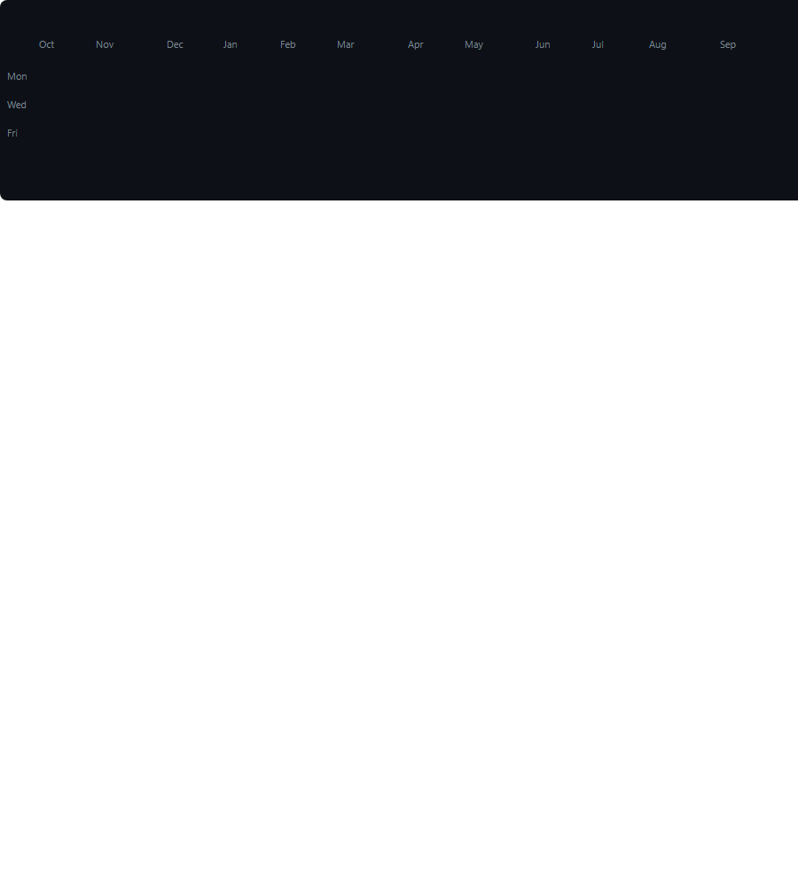



<code>sairaja@github:~$ whoami</code>

---

<table>
<tr>
<td width="50%" align="center">

</td>
<td width="50%" align="center">

</td>
</tr>
</table>

---

---

---

---

<table>
<tr>
<td width="50%" align="center">

</td>
<td width="50%" align="center">

</td>
</tr>
</table>

---

---

## <code>$ ./about-me</code>

<strong>▶ OPEN PROFILE</strong>

 

<pre>
NAME        → SAIRAJA KRISHNA
USERNAME    → SAIRAJA-2K7
ROLE        → Student Developer
SPECIALTY   → AI / ML + Full Stack + Cloud
FOCUS       → Building useful systems with polished interfaces
</pre>

I build full-stack applications, cloud-powered systems, analytics dashboards and AI/ML projects.

I enjoy taking complicated technical ideas and turning them into clean, interactive engineering experiences.

---

## <code>$ ./certifications</code>

<strong>▶ VIEW CERTIFICATIONS</strong>

 

<pre>
AWS Certified Cloud Practitioner

Cambridge Linguaskill
CEFR B2

Python Intermediate

Certificate of Excellence
Scaler School of Technology — YIIC
</pre>

---

## <code>$ ./currently-learning</code>

<strong>▶ LEARNING QUEUE</strong>

 

<pre>
[■■■■■■■■■■■■■■■■░░] Advanced DSA
[■■■■■■■■■■■■■■░░░░] Machine Learning
[■■■■■■■■■■■■■■■░░░] Cloud Architecture
[■■■■■■■■■■■■■■░░░░] System Design
[■■■■■■■■■■■■■■■░░░] Advanced React
</pre>

---

## <code>$ ./engineering-mode</code>

<strong>▶ INITIALIZE ENGINEERING MODE</strong>

 

<pre>
DESIGN
├── minimal
├── cinematic
├── responsive
└── data-driven

ENGINEERING
├── scalable
├── maintainable
├── observable
└── API-first

EXPERIENCE
├── motion
├── interaction
├── visual feedback
└── performance
</pre>

---

<code>sairaja@github:~$ echo "building something better..."</code>

  

<strong>BUILD • BREAK • DEBUG • SHIP • REPEAT</strong>

